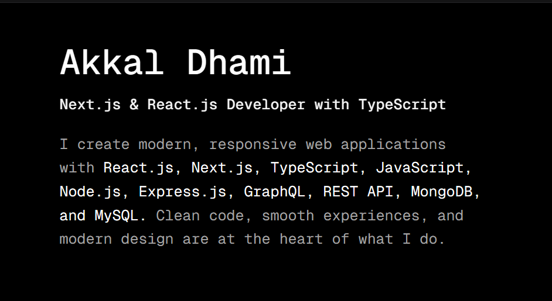

# Minimal Portfolio Template

A modern, minimal portfolio website built with [Next.js](https://nextjs.org), [TypeScript](https://www.typescriptlang.org/), and [Tailwind CSS](https://tailwindcss.com/). This template includes beautiful UI components, smooth animations, and a fully responsive design.

[Live Demo](https://akkal-min-portfolio.vercel.app/)

## License

This project is open source and available for personal use.
